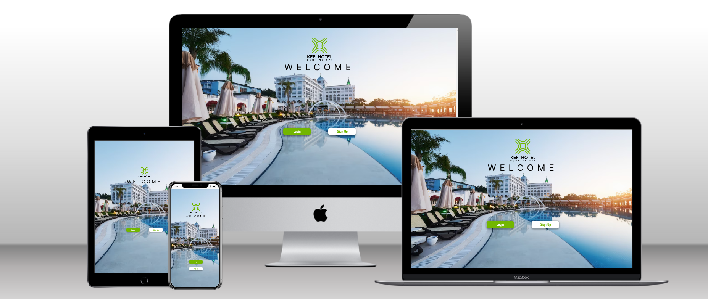
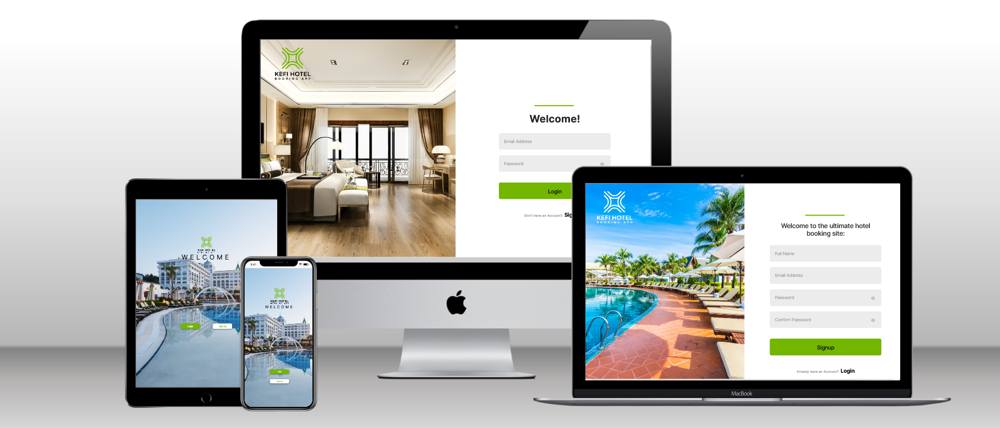
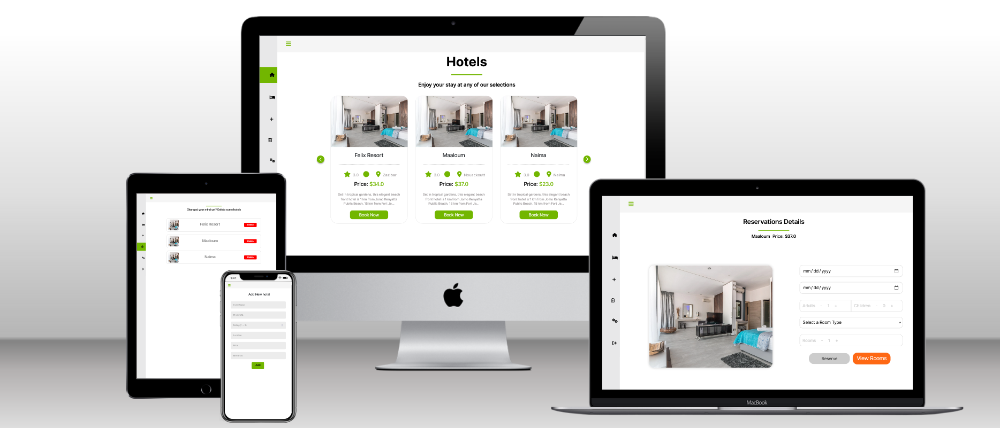
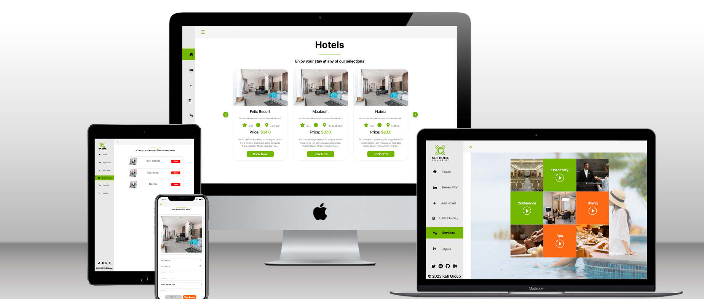

  <h3><b>Final-Capstone-back-end</b></h3>

<!-- TABLE OF CONTENTS -->

# 📗 Table of Contents

- [📗 Table of Contents](#-table-of-contents)
- [Hello world- ](#hello-world--)
  - [🛠 Built With ](#-built-with-)
    - [Tech Stack ](#tech-stack-)
  - [Key Features ](#key-features-)
  - [💻 Getting Started ](#-getting-started-)
    - [Prerequisites](#prerequisites)
    - [Setup](#setup)
    - [Install](#install)
    - [Run](#run)
  - [👥 Authors ](#-authors-)
  - [🔭 Future Features ](#-future-features-)
  - [🤝 Contributing ](#-contributing-)
  - [⭐️ Show your support ](#️-show-your-support-)
  - [🙏 Acknowledgments ](#-acknowledgments-)
  - [📝 License ](#-license-)

  <h3><b>FINAL-CAPSTONE-FRONTEND</b></h3>

<!-- PROJECT DESCRIPTION -->

# HOTEL BOOKING APP 

**HOTEL BOOKING** is the final capstone project done by a group of four, this is the frontend that takes data from the backend created with ruby on rails by getting the data through api.It consist of a splash page and login, registration, main, delete, add hotel, delete hotel and reserve hotels.

## ScreenShots of the APP

##  Design <a name="built-with">

- [Figma design](https://www.figma.com/file/2XW31wy6dXFS6vEbCpEWuo/Hotel-booking-app?type=design&node-id=0-1&t=NgA8zpxRbINmxtoE-0)

## 🛠 Built With <a name="built-with">
  <ul>
      <li>REACT </li>
      <li>JavaScript</li>
      <li>Redux Toolkits</li>
      <li>Bootstrap</li>
  </ul>
</a>

### Tech Stack 

  
Server

  <ul>
    <li><a href="https://www.ruby-lang.org/en/">Ruby</a></li>
    <li><a href="https://rubyonrails.org/">Rails</a></li>
    <li><a href="https://www.postgresql.org/">Postgresql</a></li>
    <li><a href="https://github.com/felixDev22/Final-capstone-backend.git">BACKEND[Ruby on Rails]</a><li>
  </ul>
  
Client

    <li><a href="https://github.com/felixDev22/Final-Capstone-Frontend.git">FRONTEND</a><li>

<a href="#readme-top">front to top</a>

<!-- Key Features -->

## Key Features 

- Created an API endpint by rails.
- Get the api from rails using cors
- Created a react app
- Used redux to manage the state
- Used react router to navigate through the pages
- Used react hooks to manage the state
<!-- GETTING STARTED -->

## 💻 Getting Started 

### Prerequisites

- Make sure you have Ruby installed in your system. You can install it [here](https://www.ruby-lang.org/en/documentation/installation/)

- Get started with [REACT](https://guides.rubyonrails.org/getting_started.html).

- Make sure you have [PostgreSQL](https://www.postgresql.org/) installed and running.

### Setup

- Clone this repository by running `git clone https://github.com/felixDev22/Final-Capstone-Frontend.git` in your command line.

- Navigate to the repository by running `cd Final-Capstone-Frontend`.

### Install

- Run `bundle install` to install all the gems.

### Run

- Run npm install
- Run npm start
- In your browser, go to `http://localhost:3000`.

<a href="#readme-top">front to top</a>

## 👥 Authors 

👤 **DIABY MOHAMMED IBRAHIM**

- [GitHub](https://github.com/elixDev22)
- [Twitter](https://twitter.com/kingibro345)
- [LinkedIn](https://www.linkedin.com/in/elixDev22/)

👤 **KENNEDY OWUSU**

- [GitHub](https://github.com/kennedyowusu)
- [Twitter](https://twitter.com/_iamkobby)
- [LinkedIn](www.linkedin.com/in/kennedy-owusu)

👤 **Felix Nzomo Nyamai**

- [GitHub](https://github.com/felixDev22)
- [Twitter](https://twitter.com/monzo200)
- [LinkedIn](https://www.linkedin.com/in/felixnyamai/)

👤 **Maaloum Ely Cheikh**

- [GitHub](https://github.com/maaloum)
- [Twitter](https://www.linkedin.com/in/ely-cheikh-maaloum-075a79135/)
- [LinkedIn](https://www.linkedin.com/in/ely-cheikh-maaloum-075a79135/)

<a href="#readme-top">back to top</a>

<!-- FUTURE FEATURES -->

## 🔭 Future Features 

- [ ] **Better user interface**

<!-- CONTRIBUTING -->

## 🤝 Contributing 

Contributions, issues, and feature requests are welcome!

Feel free to check the [issues page](https://github.com/felixDev22/Final-Capstone-back-end.git/issues)

<a href="#readme-top">back to top</a>

<!-- SUPPORT -->

## ⭐️ Show your support 

Give a ⭐️ if you like this project!

<a href="#readme-top">back to top</a>

## 🙏 Acknowledgments 

- I would like to thank all code reviewers and coding partners for making this project better.

(<a href="#readme-top">back to top</a>)

<!-- LICENSE -->

## 📝 License 

This project is [MIT](./LICENSE) licensed.

<a href="#readme-top">back to top</a>

